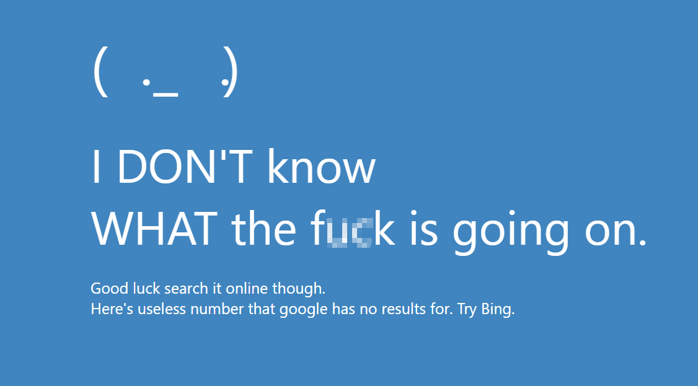

# BlueScreen<br/>一个简单的动态壁纸

这是一个简单但有趣的动态壁纸。使用HTML、CS、JS制成。<br/>
搭配<b>Wallpapper Engine</b>或其他支持<b>.html文件</b>的动态壁纸软件食用风味更佳

效果预览↑<br/>
(just kidding)

--------
### 特性
- 应该算轻量化(?) 反正一共才200来行代码
- 部分支持自定义, 支持的位置详见<b>「自定义」</b>部分
---------
### 功能
- 背景自动变色(可自定义)
- (._.) (会看着鼠标)
- 可自定义文字(比如把那个文明词汇改成真文明词汇之类的)<br/>
---------
### 食用方式
#### <s>清蒸慢炖火闷爆炒油炸...</s>
1. 打开Wallpapper Engine或其他支持.html文件的动态壁纸软件
2. 使用壁纸软件打开index.html<br/>
这样就好啦~
---------
### 自定义
使用任意文本编辑器打开index.html<br/>
以下是文字的代码(inedx.html 22~30line)
```HTML
<span id="content">
    <!--这是标题-->
    I DON'T know<br>WHAT the fuck is going on.<br>
</span>
<span id="subcontent">
   <!--这是下面的小字-->
   <br>Good luck search it online though.<br>
   Here's useless number that google has no results for. Try Bing.
</span>
```
这里控制的脸下面的那些字。<br/>
#content处控制标题， #subcontent处控制小字。<br/>
更改这些就好啦~<br/><br/><br/>

(index.html 11~19line)
```html
<div id="face_content">
    <!--这是那张脸的每个组成部分-->
    <span id="brackets_l">(</span>      <!--左脸颊-->
    <span id="eye_l">·</span>           <!--左眼-->
    <span id="mouth">_</span>           <!--嘴-->
    <span id="eye_r">·</span>           <!--右眼-->
    <span id="brackets_r">)</span>      <!--右脸颊-->
    <!--其中 眼睛是要看向鼠标的-->
</div>
```
这里控制脸的组成部分。<br/>
根据注释改就好啦~ 你也可以在style部分更改颜色之类的样式。<br/>
不要改标签的id<br/><br/><br/>

(index.html 36~81line)
```css
/* 这是背景rgb */
@keyframes bgcolor {
    0% {
        background-color: #c44040;
    }

    10% {
        background-color: #c48040;
    }

    20% {
        background-color: #80c440;
    }

    30% {
        background-color: #40c440;
    }

    40% {
        background-color: #40c480;
    }

    50% {
        background-color: #4080c4;
    }

    60% {
        background-color: #4040c4;
    }

    70% {
        background-color: #8040c4;
    }

    80% {
        background-color: #c44080;
    }

    90% {
        background-color: #c44060;
    }

    100% {
        background-color: #c44040;
    }
}
```
这里控制背景的变色。<br/>
更改每个background-color后面的值就能改变要变成的颜色啦~

---------
灵感来源：Honest Bluescreen - seekay(Wallpapper engine)，如有侵权请告知，立刻删除。

©2022 daniuge233
